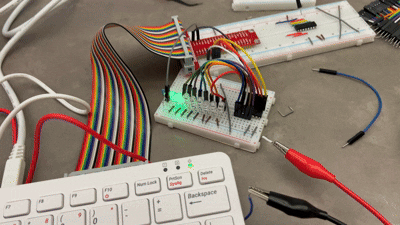

# IceTop Viewer

IceTop Viewer is a high-performance Raspberry Pi visualization system for IceCube/IceTop neutrino event data. It drives a large-scale physical display (typically an LED array representing South Pole detector stations) using complex multiplexing and hardware-timed PWM.

## Technical Implementation

### Core Principles
The project overcomes the GPIO limitations of the Raspberry Pi by using a **Multiplexed Waveform** approach. Instead of driving each LED individually, it groups them into channels and cycles through them at high speed.

- **Library**: Powered by `pigpio`, leveraging the `pigpiod` daemon for DMA-based hardware PWM and waveform generation. This ensures flicker-free performance and precise timing unaffected by system load.
- **Refresh Logic**: The system constructs generic waveforms (`pigpio.pulse`) that combine both the channel selection (via demux) and the data payload (via PWM brightness levels) in a single sequence.

### Hardware Mapping
The system uses 17 GPIO pins (BCM numbering) to control a large array of stations:

| Function | GPIO Pins (BCM) | Description |
| :--- | :--- | :--- |
| **Channel Select** | 17, 27, 22 | 3-bit address lines for a 3-to-8 demultiplexer. |
| **Data / PWM** | 4, 26, 3, 10, 9, 11, 5, 6, 13, 19, 14, 15, 18, 23 | 14 independent data lines for driving LEDs. |

### Software Pipeline
1.  **Data Ingestion**: Loads `.txt` event files containing station ID, DOM info, energy, and timestamps.
2.  **Mapping**: Uses `81_pin_table.txt` to resolve physical station IDs to specific (Pin, Channel) pairs.
3.  **Normalization**: Scaler functions map raw energy values to duty cycles (0-100%) and relative time to simulation frames.
4.  **Waveform Construction**: `event_builder.py` dynamically generates `pigpio` waveforms for each step of the simulation, updating the entire display at a target refresh rate of 256Hz.

## Setup & Requirements

### Software
- **pigpiod**: Must be installed and running (`sudo systemctl enable pigpiod && sudo systemctl start pigpiod`).
- **Python 3**: Requires `numpy`, `pigpio`, and `tkinter`.

### Execution
1.  Ensure the hardware is connected to the specified GPIO pins.
2.  Run the main builder: `python3 event_builder.py`.
3.  Select a data file (e.g., from the `data/` directory) and set the simulation duration.

---
*Developed for the IceCube Neutrino Observatory visualization project.*

## Development Timeline

### 1. Hardware Pin Validation
Testing the initial output pins from the Raspberry Pi to ensure correct voltage and signal stability.

### 2. Multiplexing Logic
First successful implementation of the 8-channel multiplexing cycle.

### 3. High Refresh Rate Optimization
Refining the `pigpio` waveform timing to eliminate flicker and achieve a stable 256Hz refresh rate.

### 4. Small-Scale Visualization
Animating a 16-LED test array with pre-recorded IceTop event data.

### 5. Assembly and Housing
Moving the circuitry to permanent breadboards and preparing the custom housing for the South Pole station array.
